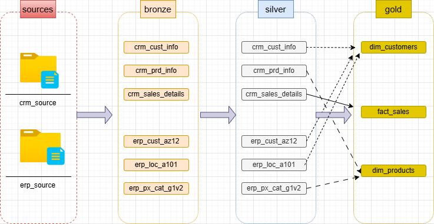
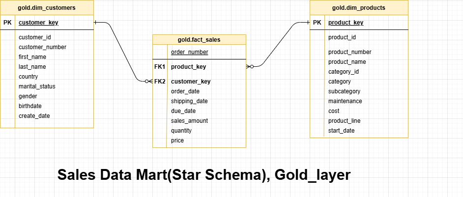

# sql-data-warehouse-project
Building modern data warehouse with postgreSql, including ETL processes, data modeling, and analytics.

This project demonstrates a comprehensive data warehousing and analytics solution, from building a data warehouse to generating actionable insights. Designed as a portfolio project
highlights industry best practices in data engineering and analytics.
Project Requirements
### Building the Data Warehouse (Data Engineering)
#### Objective
Develop a modern data warehouse using postgreSql to consolidate sales data, enabling analytical reporting and informed decision-making.
#### Specifications
**Data Sources**: Import data from two source systems (ERP and CRM) provided as **CSV files**.  
**Data Quality**: Cleanse and resolve data quality issues prior to analysis.  
**Integration**: Combine both sources into a single, user-friendly data model **(star_schema)** designed for analytical queries.  
**Scope**: Focus on the latest dataset  historization of data is not required.  
**Documentation**: Provide clear documentation of the data model to support both business stakeholders and analytics teams.  

## License
This project is licensed under the [MIT License] (LICENSE). You are free to use, modify, and share this project with proper attribution.
## About Me  
Hi there! I'm **Gaurav Menaria**, I'm an computer science student, and passionated about **data engineering**  

### <- data_flow_diagram ->

### <- sales_data_mart (gold_layer) ->

